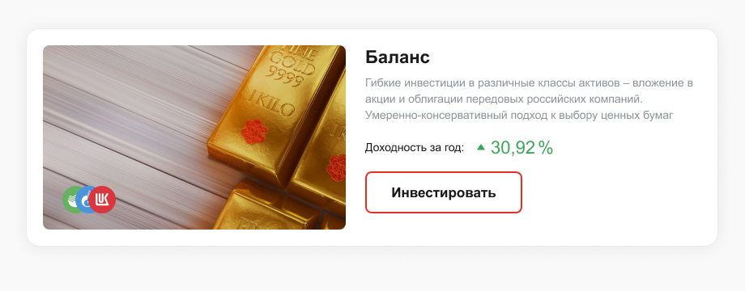
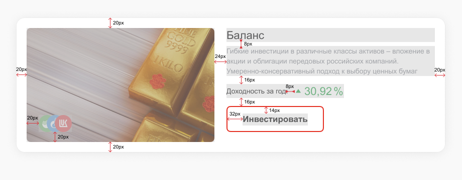

# Задача по вёрстке для собеседования на позицию фронтенд-разработчика в компанию Альфа-Капитал

Нужно сверстать карточку товара по макету.

При вёрстке важно учесть, чтобы кнопка имела тег `button`.

### Дизайн:



### Дизайн с указанием размеров:



#### Размеры:

- Размер картинки продукта: `374x228px`
- Размер картинки эмитента: `34x34px`
- Ширина блока с текстом: `415px`
- Высота кнопки: `52px`
- Скругление карточки: `16px`
- Скругление картинки: `8px`
- Скругление кнопки: `8px`

#### Шрифты

- Размер основного текста: `14px`
- Интерлиньяж основного текста: `20px`
- Размер заголовка и доходности: `22px`
- Интерлиньяж заголовка и доходности: `28px`
- Размер кнопки: `17px`

#### Цвета

- Фон карточки: `#fff`
- Основной цвет текста: `#19191a`
- Цвет текста описания продукта: `#8e9299`
- Цвет доходности: `#3ba659`
- Цвет рамки у кнопки: `#e52f22`
- Цвет фона у кнопки при наведении: `rgba(199, 45, 32, 0.1)`

#### Изображения

- Продукт: `./src/product.png`
- Лукоил: `./src/e_lukoil.png`
- Газпром: `./src/e_gazprom.png`
- Сбер: `./src/e_sber.jpg`

#### SVG-иконка

```svg
<svg xmlns="http://www.w3.org/2000/svg" viewBox="0 0 24 24">
    <path d="M12.41 15.285a.5.5 0 01-.821 0L7.347 9.163a.5.5 0 01.411-.785h8.483a.5.5 0 01.411.785l-4.241 6.122z"/>
</svg>
```
